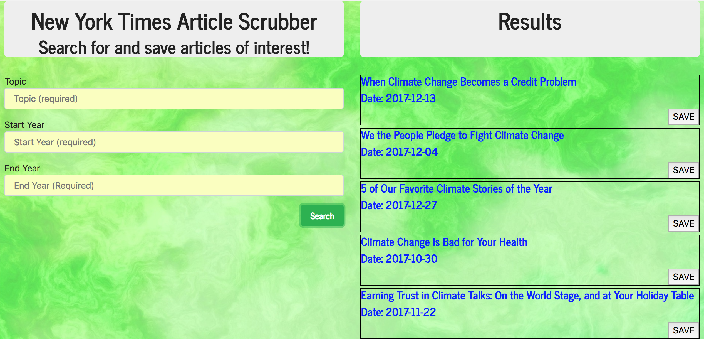

This project makes a call to the New York Times API, displays articles,   
and allows the user to save articles or delete saved articles.  
User enters topic, start year, and end year.  
Articles are displayed with a SAVE button. User clicks on SAVE button to save article to database.
All saved articles are displayed with a DELETE button. User can delete a saved article. 
 
 
